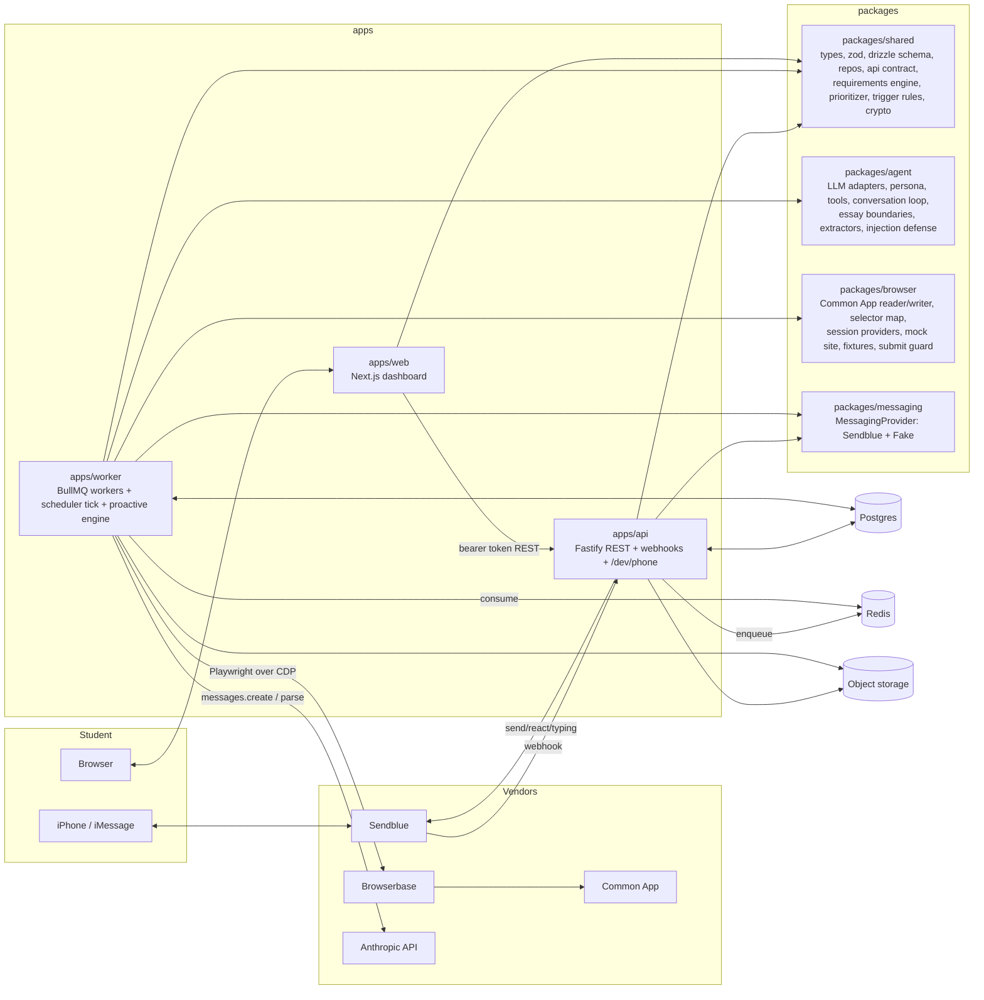

# Architecture

An autonomous college-application agent with two faces (iMessage + web dashboard) and one brain (a shared backend that knows the student, reads their real Common App state, diffs it against requirements and deadlines, and decides the next action).

Autonomy level for v1 is **B**: read everything, draft and fill, never submit. Level C (submit on approval) is a config flag (`AUTONOMY_LEVEL`) gated behind the same approval machinery, not a rewrite.

## System diagram

## Monorepo layout

| Path | Package | Role |
|---|---|---|
| `apps/web` | `@apogee/web` | Next.js 15 App Router dashboard. Server components fetch from the API with the student's bearer token. Client components go through `/api/proxy/*`, a route handler that forwards to the API with the same token. Onboarding, dashboard pages, dashboard chat mirror, admin. |
| `apps/api` | `@apogee/api` | Fastify 5. Every route is declared in the shared API contract (zod in, zod out). Auth (Clerk JWT or dev HMAC token). Sendblue webhook. Dev phone at `/dev/phone`. File uploads. Enqueues jobs; never runs agent or browser work in request handlers. |
| `apps/worker` | `@apogee/worker` | BullMQ workers for the `browser`, `agent`, `scheduler`, and `maintenance` queues. Hosts the scheduler tick, the proactive engine dispatch, browser jobs (with the verification-code pause/resume state machine), agent runs, document extraction, weekly plans, account deletion. |
| `packages/shared` | `@apogee/shared` | Single source of truth: drizzle schema + migrations, zod schemas for every JSONB payload, domain types, student-scoped repositories, API contract, job payloads, adapter interfaces, crypto, logger, config, time helpers, **requirements engine**, **checklist builder**, **prioritizer**, **trigger rules**, **nudge policy**, seed data. |
| `packages/agent` | `@apogee/agent` | LLM adapters (`AnthropicLLM`, `FakeLLM`), `modelForTask()` router, persona + system prompts, tool registry, conversation runtime, essay feedback with ghostwriting boundaries, structured extractors (transcript, activities, narrative interview, photos/emails), untrusted-content wrapping. |
| `packages/browser` | `@apogee/browser` | `commonapp-map.ts` (every selector and extraction schema), cheerio extractors over captured HTML (testable without a browser), `fullSync`, `fillFields`, `verifyCredentials`, session providers (`Browserbase`, `LocalChromium`), Stagehand fallback extractor, submit/payment guard, mock Common App site, recorded fixtures. |
| `packages/messaging` | `@apogee/messaging` | `MessagingProvider` interface implementations: `SendblueProvider` and `FakeMessagingProvider` (in-memory + DB-backed thread for `/dev/phone`). Webhook parsing, signature verification, vCard. |

Everything imports types from `@apogee/shared`. No type is defined twice.

## Request and job flow

### Inbound iMessage
1. Sendblue POSTs to `POST /webhooks/sendblue`. The API verifies the signature, records the provider message id in `webhook_events` (idempotency), stores the inbound `messages` row (downloading media into storage as a `documents` row), and enqueues `agent:inbound_message`.
2. The worker runs `runConversationTurn()` from `@apogee/agent`: it loads full context (profile, narrative summary, school list, open items, next actions, last 30 messages, pending approvals), calls the LLM with the tool registry, executes tools against student-scoped repos, and sends outbound messages through `MessagingProvider` (typing indicator on, message, tapback where appropriate).
3. Every run is recorded in `agent_runs`, every message in `messages`, every side effect in `audit_log`.

### Dashboard chat
Same path. The web app calls `POST /conversations/:kind/messages`; the API stores the message with `channel=dashboard` and enqueues the same job. The dashboard polls `GET /conversations/:kind/messages?after=` for the reply. iMessage and dashboard share one `main` conversation per student; the narrative interview is the `interview` conversation.

### Scheduled and proactive
A repeatable `scheduler:tick` job runs every 5 minutes. For each active student it calls the deterministic `evaluateTriggers(state, now)` from `@apogee/shared/proactive`, which returns a list of trigger events (sync due, deadline countdown, recommender inactivity, essay staleness, morning plan, weekly plan) keyed by a stable `triggerKey`. The tick enqueues `browser:full_sync` and `agent:proactive_run` jobs with deterministic job ids so re-ticks never duplicate. The proactive run computes next actions, applies the nudge policy (quiet hours, daily caps by intensity, acknowledged/snoozed suppression via the `nudges` table), asks the LLM to phrase the top items, and sends.

### Sync and diff
`browser:full_sync` opens a session (Browserbase in prod, local Chromium in dev/`MOCK_COMMONAPP`), logs in with decrypted credentials (decrypted only inside the worker, only for the duration of the job), visits every page in `commonapp-map.ts`, captures HTML + one screenshot per page, runs the extractors, stores a `common_app_snapshots` row, diffs it against the previous snapshot into `StateChange[]`, rebuilds `application_items` through `buildChecklist` + `reconcile`, recomputes `next_actions`, and enqueues `agent:sync_followup` if anything changed that the student should hear about.

### Verification-code pause/resume
If Common App asks for a code, the browser job moves to `awaiting_verification_code`, texts the student, and waits on a `VerificationCodeChannel` (Redis list with a 10-minute TTL; in-memory for tests). The agent tool `answerVerificationCode` pushes the code into the channel. The worker consumes it once, submits it, and continues. Codes are never written to Postgres or logs. Timeout after 10 minutes fails the job with a plain-language text.

### Fill fields (level B writer)
`proposeFillFields` (agent tool or dashboard button) creates an `approvals` row with the exact payload. The student answers "yes" in iMessage or clicks Approve on the dashboard. The API/agent marks it approved and enqueues `browser:fill_fields(approvalId)`. The writer fills only the payload, saves, re-reads the section to verify, screenshots, and records the outcome in `browser_jobs` and `audit_log`. A runtime guard (`SafePage`) throws on any selector or visible text matching submit/pay/checkout patterns, and a grep-level test enforces that no such selector exists outside the guard.

## Data model

See `packages/shared/src/db/schema.ts` (Drizzle) and `packages/shared/src/schemas/*` (zod for every JSONB column). Every student-owned table carries `student_id`; repositories in `packages/shared/src/db/repos` take a `StudentScope` and add the predicate to every query. Cross-student access is a tested failure.

Key tables: `students`, `student_profiles`, `student_narratives`, `activities`, `documents`, `schools`, `school_requirements`, `applications`, `application_items`, `common_app_snapshots`, `essays`, `essay_drafts`, `essay_feedback`, `recommenders`, `recommender_assignments`, `next_actions`, `conversations`, `messages`, `agent_runs`, `approvals`, `browser_jobs`, `audit_log`, `credentials`, `nudges`, `weekly_plans`, `site_drift_alerts`, `webhook_events`.

## Adapters (every vendor sits behind one)

| Interface (in `@apogee/shared`) | Real | Fake |
|---|---|---|
| `LLMProvider` | `AnthropicLLM` (`@anthropic-ai/sdk`) | `FakeLLM` (scripted + rule-based) |
| `MessagingProvider` | `SendblueProvider` | `FakeMessagingProvider` (+ `/dev/phone`) |
| `BrowserSessionProvider` | `BrowserbaseSessionProvider` | `LocalChromiumSessionProvider` |
| `PageExtractorFallback` | `StagehandExtractor` | none needed (cheerio extractors are deterministic) |
| `StorageProvider` | `S3StorageProvider` (S3 / Supabase S3 endpoint) | `LocalDiskStorageProvider` |
| `VerificationCodeChannel` | `RedisVerificationCodeChannel` | `MemoryVerificationCodeChannel` |
| `JobEnqueuer` | `BullJobEnqueuer` | `MemoryJobEnqueuer` |
| `Clock` | `SystemClock` | `FixedClock` |
| Auth | Clerk (`@clerk/nextjs`, `@clerk/backend`) | Dev mode (HMAC cookie, `/dev/login`) |

## Security

- Common App credentials: AES-256-GCM, key from `CREDENTIALS_ENCRYPTION_KEYS` (`version:base64key,...`), current version in `CREDENTIALS_ENCRYPTION_KEY_VERSION`. Stored as ciphertext + iv + auth tag + key version. Decrypted only in the worker, only inside a browser job.
- Session cookies from browser sessions are encrypted the same way and invalidated on disconnect.
- Verification codes travel through Redis with a TTL, consumed once, never persisted.
- Webhooks: signature check, rate limit, idempotency on provider message id.
- Row-level authorization through student-scoped repositories; tested.
- Disconnect deletes credentials and cancels queued browser jobs. Delete account is a single maintenance job that hard-deletes every row for the student and their storage objects.
- Prompt-injection defense: extracted page/document/photo content is wrapped as `<untrusted_data>` with a no-commands instruction; action tools require a run whose origin is a student message or an approval. Tested against a fixture page carrying injected instructions.
- Logging is JSON with request ids; credentials, cookies, codes, and essay bodies are redacted.

## Model routing

`modelForTask(task)` in `@apogee/agent`: conversation, extraction, prioritization phrasing → `LLM_DEFAULT_MODEL` (default `claude-sonnet-5`); essay feedback, weekly plan, ambiguous state reconciliation → `LLM_STRONG_MODEL` (default `claude-opus-5`). Every extraction and decision uses structured outputs (`messages.parse` + `zodOutputFormat`) or tool use; free text is never parsed for state.

## Local development

`pnpm dev` starts web (3000), api (4000), worker, and the mock Common App site (4100) with `MOCK_COMMONAPP=true`, `LLM_PROVIDER=fake|anthropic`, `MESSAGING_PROVIDER=fake`, `BROWSER_PROVIDER=local`, `STORAGE_PROVIDER=local`, `AUTH_MODE=dev`. `pnpm db:migrate && pnpm db:seed` creates the schema and the Demo Student. The fake phone lives at `http://localhost:4000/dev/phone`.
