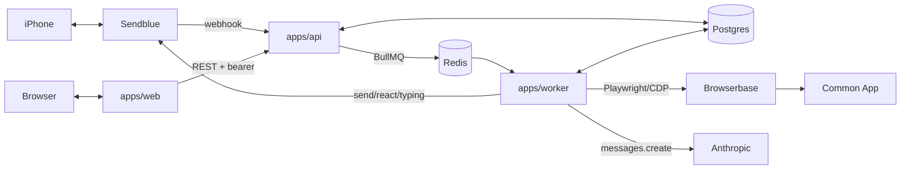

# Apogee — an autonomous college-application agent

An autonomous, proactive college-application agent for high-school seniors who don't have a paid counselor. It has two faces and one brain:

- **An iMessage agent** ("Vector" by default). The student texts a real phone number. It texts first when something needs attention, reacts with tapbacks, shows a typing indicator, and handles photos in and out.
- **A web dashboard**: every school, deadline, checklist item, essay, and recommender, plus a live feed of everything the agent did and saw.

Behind both: a backend that holds deep context on the student from onboarding, logs into their Common App through a cloud browser to read real application state, diffs it against requirements and deadlines every few hours, and decides the student's next action.

Autonomy level for v1 is **B**: read everything, draft and fill, never submit. It never clicks Submit, never pays a fee, never contacts a teacher or school, and never writes essay text. Level C (submit on explicit approval) is a config flag on the same approval gate.

## Architecture

See [ARCHITECTURE.md](ARCHITECTURE.md) for the full design, the data model, and the adapter table. In one picture:



| Package | What it is |
|---|---|
| `apps/web` | Next.js dashboard: onboarding, Today, Schools, Essays, Recommenders, Timeline, Vector (the iMessage thread), Activity, Profile, Settings, Admin |
| `apps/api` | Fastify API implementing the shared contract, Sendblue webhook, dev phone at `/dev/phone`, uploads |
| `apps/worker` | BullMQ workers: scheduler tick, browser jobs (sync, verify, fill) with verification-code pause/resume, agent runs, proactive nudges, maintenance |
| `packages/shared` | Drizzle schema + migrations, zod schemas, API contract, adapters, scoped repos, requirements engine, prioritizer, trigger rules, nudge policy, seed |
| `packages/agent` | LLM adapters (Anthropic + deterministic fake), persona, tools with an origin guard, conversation/proactive/essay/extraction runtimes |
| `packages/browser` | Common App selector map, extractors, diff, submit guard, session providers (Browserbase, local Chromium), mock Common App site, fixtures |
| `packages/messaging` | `MessagingProvider`: Sendblue and a fake with a phone simulator |

## Run it locally

Prerequisites: Node 22, pnpm 10, Postgres 16, Redis 7 (`docker compose up -d` starts both), and Chromium for Playwright (`npx playwright install chromium`, or set `PLAYWRIGHT_CHROMIUM_EXECUTABLE_PATH`).

```bash
cp .env.example .env          # defaults are all-local: fake LLM, fake iMessage, local Chromium, mock Common App
pnpm install
pnpm db:ready                 # creates dev + test databases, applies migrations, seeds the school dataset and Demo Student
pnpm dev                      # web :3000, api :4000, worker (+ mock Common App :4100)
```

Then:

- Dashboard: http://localhost:3000 → `/dev/login` → "Demo student" (or "New student" to run onboarding from scratch)
- Fake phone: http://localhost:4000/dev/phone (type as the student; the agent replies through the worker)
- Mock Common App: http://localhost:4100 (login `demo@example.com` / `demo-password`; set `COMMONAPP_MOCK_VERIFICATION_CODE=246810` to exercise the code round-trip)
- Admin: log in as `admin@example.com`

The Demo Student has 12 schools, partially completed Common App state, essays, recommenders, and a conversation, so every page has real data before you connect anything.

### With the real services

Set these in `.env` (see the comments in `.env.example` for where each comes from):

```
LLM_PROVIDER=anthropic         ANTHROPIC_API_KEY=...
MESSAGING_PROVIDER=sendblue    SENDBLUE_API_KEY_ID=... SENDBLUE_API_SECRET_KEY=... SENDBLUE_PHONE_NUMBER=+1... SENDBLUE_WEBHOOK_SECRET=...
BROWSER_PROVIDER=browserbase   BROWSERBASE_API_KEY=... BROWSERBASE_PROJECT_ID=...
MOCK_COMMONAPP=false
AUTH_MODE=clerk                CLERK_SECRET_KEY=... NEXT_PUBLIC_CLERK_PUBLISHABLE_KEY=...
STORAGE_PROVIDER=s3            S3_*=...
CREDENTIALS_ENCRYPTION_KEYS=1:$(openssl rand -base64 32)
```

Point Sendblue's inbound webhook at `https://<api>/webhooks/sendblue`. Production deployment is in [DEPLOY.md](DEPLOY.md).

## Tests

```bash
pnpm build        # typecheck every package, bundle api/worker, next build
pnpm test         # every package's vitest suite (needs DATABASE_URL_TEST and Redis)
pnpm lint
pnpm test:live    # agent tests against the real Anthropic API (needs ANTHROPIC_API_KEY)
```

Browser tests need `PLAYWRIGHT_CHROMIUM_EXECUTABLE_PATH` or a Playwright-installed Chromium.

## Adding a school to the requirements dataset

1. Open the right group file under `packages/shared/src/requirements/dataset/` (`ivy-plus`, `top-privates`, `flagships`, `lacs`, `rolling-safeties`).
2. Add a `school({...})` entry: `slug` (stable, lowercase), `name`, `aliases` (what students call it), `common_app_member` (+ `portal_url` if not), and `requirements`: `plans` with deadlines, `supplements` with stable `id`s and word limits, `recommendations`, `test_policy`, `css_profile`, `interview_policy`, `midyear_report`, `portfolio`, `application_fee`, `fee_waiver_eligible`.
3. Mark anything you have not confirmed with `needs_verification: true` at the field level (plans, supplements, css_profile) and at the entry level. Never present a guessed date as fact; the agent verifies flagged values against the school's Common App page during sync and clears the flag.
4. Run `pnpm -F @apogee/shared test` (the dataset test validates every entry) and `pnpm db:seed` to upsert it.

## Documents

- [ARCHITECTURE.md](ARCHITECTURE.md) — design, flows, data model, adapters, security
- [DECISIONS.md](DECISIONS.md) — every judgment call and why
- [DEPLOY.md](DEPLOY.md) — production deployment, step by step
- [PRIVACY.md](PRIVACY.md) — what is stored, what the agent can and cannot do, how to leave
- [KNOWN_GAPS.md](KNOWN_GAPS.md) — what could not be completed or verified
- [NEXT_STEPS.md](NEXT_STEPS.md) — what it takes to run this for real students next week
- [TASKS.md](TASKS.md) — the build board

## Design

The dashboard is designed, not themed: the concept, palette, type, spacing and rules are in [docs/DESIGN.md](docs/DESIGN.md), every color and size comes from `apps/web/app/tokens.css`, and the component system lives in `apps/web/components/system` (a kitchen sink renders at `/dev/system` in development). Review notes are in [docs/DESIGN_REVIEW.md](docs/DESIGN_REVIEW.md). Every page is captured at 390px and 1280px in dark and light under [docs/screenshots](docs/screenshots); regenerate them against a running stack with:

```
PLAYWRIGHT_CHROMIUM_EXECUTABLE_PATH=/path/to/chrome pnpm -F @apogee/web screenshots
```

The theme follows the device by default; Settings offers dark, light or system.
